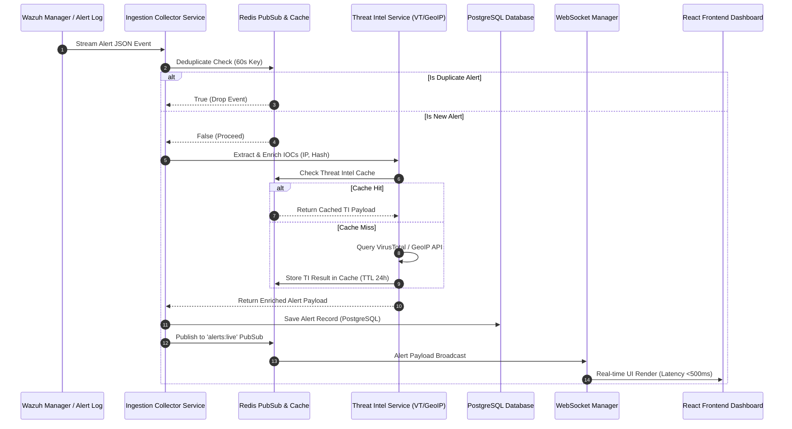
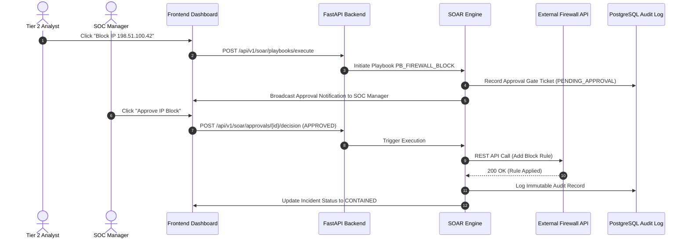

# System Sequence Diagrams
## Enterprise Mini SOC Platform

### 1. Alert Ingestion & Enrichment Sequence Diagram

```mermaid
sequenceDiagram
    autonumber
    participant Wazuh as Wazuh Manager / Alert Log
    participant Ingestor as Ingestion Collector Service
    participant Redis as Redis PubSub & Cache
    participant TI as Threat Intel Service (VT/GeoIP)
    participant DB as PostgreSQL Database
    participant WS as WebSocket Manager
    participant UI as React Frontend Dashboard

    Wazuh->>Ingestor: Stream Alert JSON Event
    Ingestor->>Redis: Deduplicate Check (60s Key)
    alt Is Duplicate Alert
        Redis-->>Ingestor: True (Drop Event)
    else Is New Alert
        Redis-->>Ingestor: False (Proceed)
        Ingestor->>TI: Extract & Enrich IOCs (IP, Hash)
        TI->>Redis: Check Threat Intel Cache
        alt Cache Hit
            Redis-->>TI: Return Cached TI Payload
        else Cache Miss
            TI->>TI: Query VirusTotal / GeoIP API
            TI->>Redis: Store TI Result in Cache (TTL 24h)
        end
        TI-->>Ingestor: Return Enriched Alert Payload
        Ingestor->>DB: Save Alert Record (PostgreSQL)
        Ingestor->>Redis: Publish to 'alerts:live' PubSub
        Redis->>WS: Alert Payload Broadcast
        WS->>UI: Real-time UI Render (Latency <500ms)
    end
```

---

### 2. SOAR IP Block Approval Sequence Diagram

```mermaid
sequenceDiagram
    autonumber
    actor Analyst as Tier 2 Analyst
    actor Manager as SOC Manager
    participant UI as Frontend Dashboard
    participant API as FastAPI Backend
    participant SOAR as SOAR Engine
    participant FW as External Firewall API
    participant DB as PostgreSQL Audit Log

    Analyst->>UI: Click "Block IP 198.51.100.42"
    UI->>API: POST /api/v1/soar/playbooks/execute
    API->>SOAR: Initiate Playbook PB_FIREWALL_BLOCK
    SOAR->>DB: Record Approval Gate Ticket (PENDING_APPROVAL)
    SOAR->>UI: Broadcast Approval Notification to SOC Manager
    Manager->>UI: Click "Approve IP Block"
    UI->>API: POST /api/v1/soar/approvals/{id}/decision (APPROVED)
    API->>SOAR: Trigger Execution
    SOAR->>FW: REST API Call (Add Block Rule)
    FW-->>SOAR: 200 OK (Rule Applied)
    SOAR->>DB: Log Immutable Audit Record
    SOAR->>UI: Update Incident Status to CONTAINED
```
