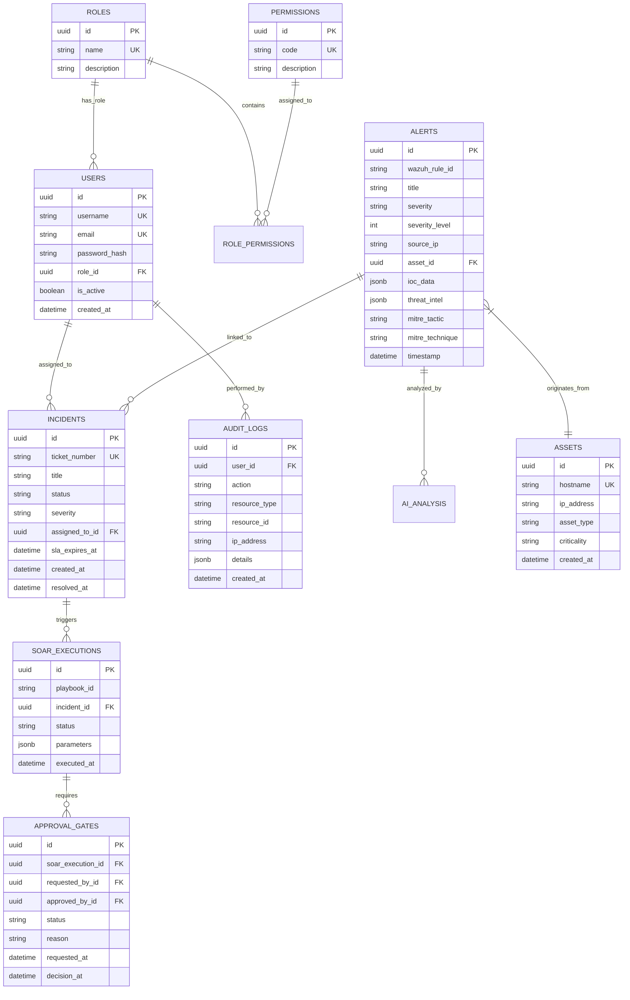

# Entity Relationship Diagram (ERD) Blueprint
## Enterprise Mini SOC Platform

### 1. Database Entity Relationship Diagram (Mermaid)

```mermaid
erDiagram
    USERS ||--o{ INCIDENTS : "assigned_to"
    USERS ||--o{ AUDIT_LOGS : "performed_by"
    ROLES ||--o{ USERS : "has_role"
    ROLES ||--o{ ROLE_PERMISSIONS : "contains"
    PERMISSIONS ||--o{ ROLE_PERMISSIONS : "assigned_to"

    ALERTS ||--o{ INCIDENTS : "linked_to"
    ALERTS ||--o{ AI_ANALYSIS : "analyzed_by"
    ALERTS }|--|| ASSETS : "originates_from"

    INCIDENTS ||--o{ SOAR_EXECUTIONS : "triggers"
    SOAR_EXECUTIONS ||--o{ APPROVAL_GATES : "requires"

    USERS {
        uuid id PK
        string username UK
        string email UK
        string password_hash
        uuid role_id FK
        boolean is_active
        datetime created_at
    }

    ROLES {
        uuid id PK
        string name UK
        string description
    }

    PERMISSIONS {
        uuid id PK
        string code UK
        string description
    }

    ASSETS {
        uuid id PK
        string hostname UK
        string ip_address
        string asset_type
        string criticality
        datetime created_at
    }

    ALERTS {
        uuid id PK
        string wazuh_rule_id
        string title
        string severity
        int severity_level
        string source_ip
        uuid asset_id FK
        jsonb ioc_data
        jsonb threat_intel
        string mitre_tactic
        string mitre_technique
        datetime timestamp
    }

    INCIDENTS {
        uuid id PK
        string ticket_number UK
        string title
        string status
        string severity
        uuid assigned_to_id FK
        datetime sla_expires_at
        datetime created_at
        datetime resolved_at
    }

    SOAR_EXECUTIONS {
        uuid id PK
        string playbook_id
        uuid incident_id FK
        string status
        jsonb parameters
        datetime executed_at
    }

    APPROVAL_GATES {
        uuid id PK
        uuid soar_execution_id FK
        uuid requested_by_id FK
        uuid approved_by_id FK
        string status
        string reason
        datetime requested_at
        datetime decision_at
    }

    AUDIT_LOGS {
        uuid id PK
        uuid user_id FK
        string action
        string resource_type
        string resource_id
        string ip_address
        jsonb details
        datetime created_at
    }
```
